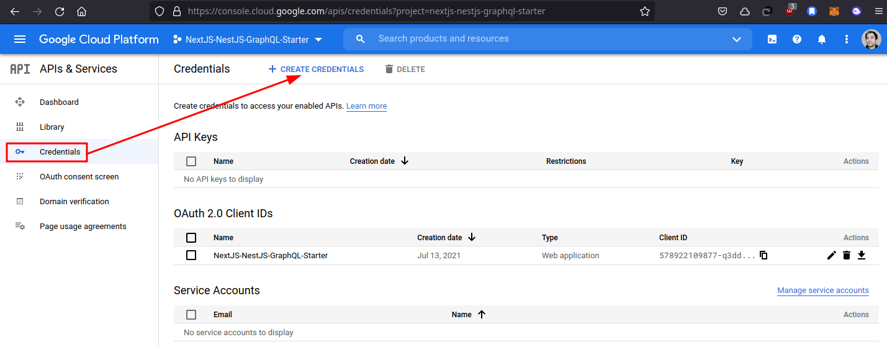
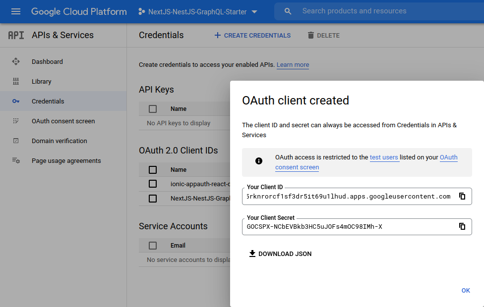
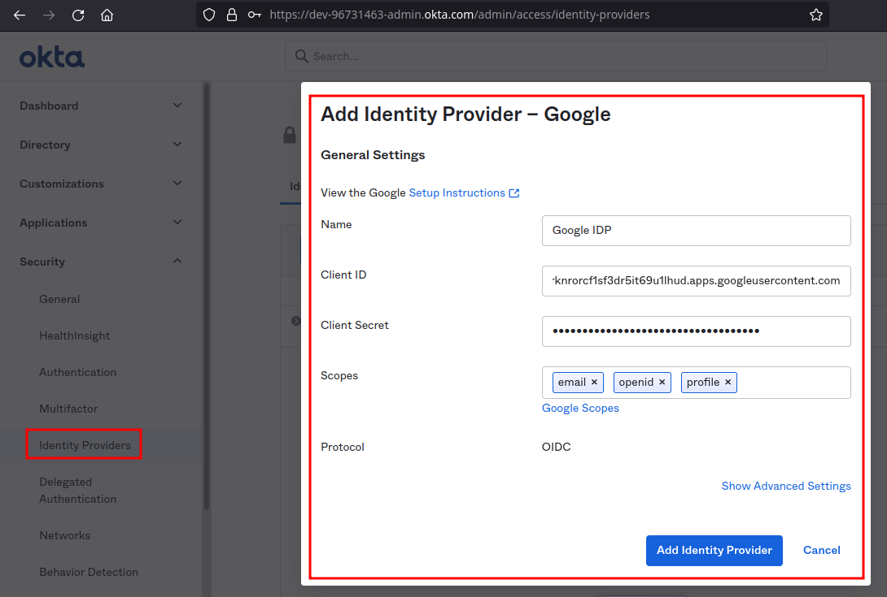
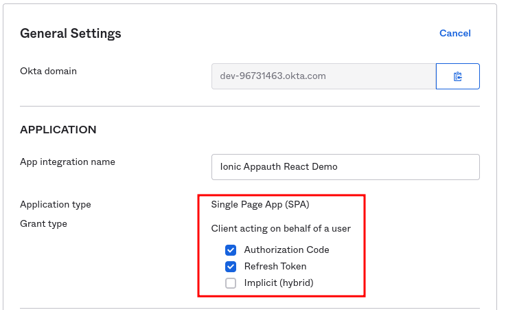
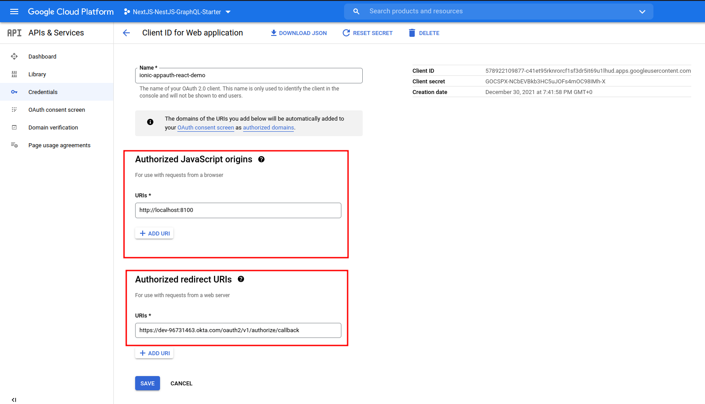

# IonicAppauthReactDemo NOTES

## TLDR

```shell
$ ionic server
```

now open `https://kuartzo.com:810`


## Source Repo

- [ionic-appauth-react-demo.git](https://github.com/creasoft-dev/ionic-appauth-react-demo.git)

## Run

```shell
$ HOST=localhost ionic serve
```

## Links

- [OAuth 2.0 for Client-side Web Applications &nbsp;|&nbsp; Google Identity &nbsp;|&nbsp; Google Developers](https://developers.google.com/identity/protocols/oauth2/javascript-implicit-flow)

- [Add a social login (IdP)](https://help.okta.com/en/prod/Content/Topics/Security/idp-social.htm)

- [Okta identity providers](https://dev-96731463-admin.okta.com/admin/access/identity-providers)

## Create Google IdP (Identity Provider)

Google Cloud Plataform > Apis and Services > Credentials

- [Goto Project](https://console.cloud.google.com/apis/credentials/oauthclient/578922109877-c41et95rknrorcf1sf3dr5it69u1lhud.apps.googleusercontent.com?project=nextjs-nestjs-graphql-starter)





- Client ID: 578922109877-c41et95rknrorcf1sf3dr5it69u1lhud.apps.googleusercontent.com
- Client secret: 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
- Google IdP ID: 0oa3gq27xnkurdkQm5d7

Okta > Applications








`.env`

```shell
REACT_APP_AUTH_CLIENT_ID="0oa3ffbb80Eh2R1j15d7"
REACT_APP_AUTH_SERVER_HOST="https://dev-96731463.okta.com"
REACT_APP_AUTH_SCOPES="openid profile email offline_access"
REACT_APP_AUTH_EXTRA_IDP="0oa3gq27xnkurdkQm5d7"
```

the trick to get refreshTokens working on okta is using request `offline_access` scope to....???

## Ios Trick is Using `ionic capacitor run ios`

https://github.com/google/GTMAppAuth/issues/31
https://github.com/FormidableLabs/react-native-app-auth/pull/659

when use ios when click sign in it does nothing, but we use this line it works

`"ios-debug": "HOST=localhost ionic capacitor run ios --livereload --consolelogs --serverlogs"`
if we use 
`"ios-build": "HOST=localhost ionic capacitor build ios --livereload --consolelogs --serverlogs"` it will not work, fuck so many time debug and it's a stupid run / build annoying thing, how cares, move on :)

```shell
$ rm -R ios
$ npx cap add ios
```

now `URLSchemes` to `info.plist`, can add top of file, to be visible

```xml
<?xml version="1.0" encoding="UTF-8"?>
<!DOCTYPE plist PUBLIC "-//Apple//DTD PLIST 1.0//EN" "http://www.apple.com/DTDs/PropertyList-1.0.dtd">
<plist version="1.0">
<dict>
	<key>CFBundleURLTypes</key>
	<array>
		<dict>
			<key>CFBundleURLName</key>
			<!--<string>com.getcapacitor.capacitor</string>-->
			<string>com.appauth.demo</string>
			<key>CFBundleURLSchemes</key>
			<array>
				<!--<string>capacitor</string>-->
				<string>com.appauth.demo</string>
			</array>
		</dict>
	</array>
	...
```

```shell
# the one that work
$ npm run ios-debug
```